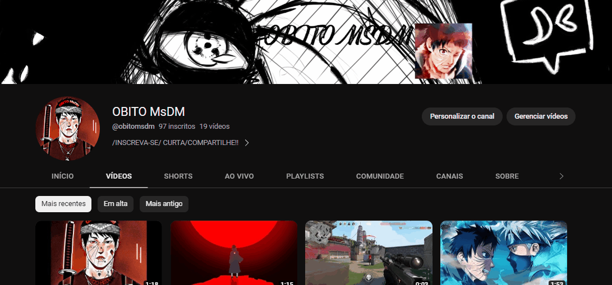

# Projeto com README
Um projeto de teste com um arquivo README 🐱‍🏍

[](https://www.youtube.com/@obitomsdm/videos)

## Tecnologias utilizadas 
- HTML
- CSS
- JS

## como utiliizar

1 - Clone o projeto
```
git clone
```

2 - Acesse a pasta do projeto
```
cd repositorio-com-readme
```